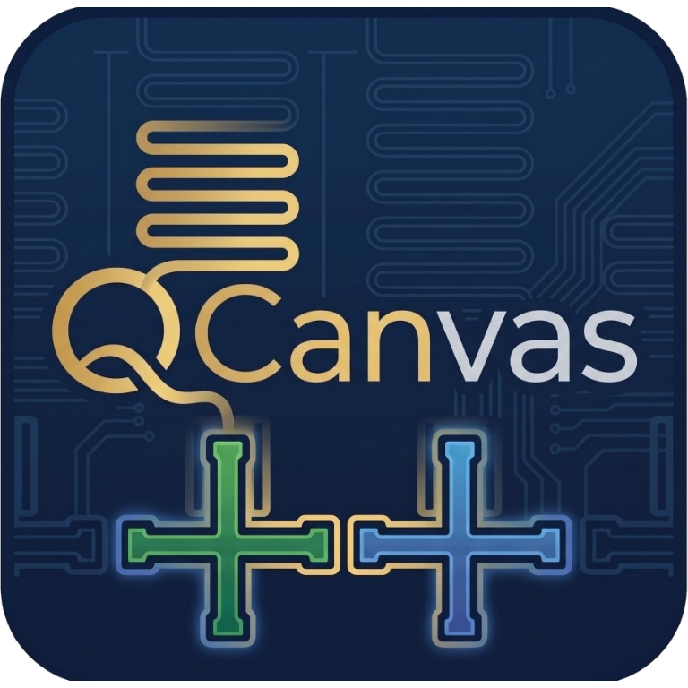
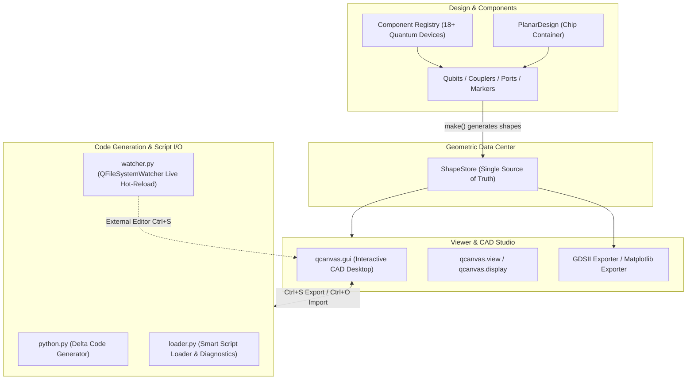

<p align="center">
  
</p>

<h1 align="center">QCanvas</h1>

<p align="center">
  <b>Superconducting Quantum Circuit CAD & Layout Design Framework</b><br>
  <sub>A modern, decoupled, plugin-driven EDA studio for superconducting quantum chip design.</sub>
</p>

<p align="center">
  <a href="https://github.com/quantum-panda-a/QCanvas/blob/main/LICENSE"></a>
  
  
</p>

---

## 📖 Introduction

**QCanvas** is a modern parametric CAD and layout design framework tailored for superconducting quantum computing chips. It bridges the gap between **code-driven EDA scripting** and **interactive visual design**, empowering quantum researchers and engineers to build, inspect, simulate, and export fabrication-ready lithography masks with speed and precision.

### Key Highlights & Core Philosophy

- 🧩 **Decoupled Architecture**: Geometric shape generation (`Component`) is strictly separated from rendering and mask production (`Exporter`). Components populate a centralized store without knowing how or where they are drawn.
- 📦 **Single Source of Truth (`ShapeStore`)**: The `ShapeRecord` dataclass stores primitive polygon geometries, physical layers, operational attributes (positive pattern vs. ground plane `subtract`), and design metadata.
- 📏 **Seamless Physical Unit Parsing**: Native support for physical dimension strings (`"455um"`, `"10nm"`, `"2.5mm"`, `"300um"`), automatically resolved to micrometres ($\mu\text{m}$) without manual conversions.
- 🎨 **Interactive CAD Desktop Studio (`qcanvas.gui`)**:
  - **Blank Startup Canvas**: Clean wafer substrate view with CAD crosshair, grid, and physical scale bar.
  - **Component Library Palette**: 18+ pre-built superconducting devices categorized into Qubits, Couplers, Ports & Pads, Alignment Markers, and Text.
  - **Interactive Ghost Placement**: Live ghost outline preview, orientation rotation (`[R]`), and micro-meter grid snapping (10 µm, 25 µm, 50 µm, 100 µm).
  - **Property Inspector**: Real-time parameter tweaking with immediate canvas feedback.
  - **Distance Measurement Ruler**: Interactive point-to-point CAD distance measurement (`[M]`).
  - **9 Preset Scientific Themes**: Nature Clean Light, Cyber Quantum, Nordic Amber, Sycamore Aurora, Prussian & Coral, and more.
- ⚡ **Code-as-Design Dual-Sync & Live Hot-Reload**:
  - **Export to Python Script (`Ctrl+S`)**: Exports clean, standalone `.py` scripts with delta parameter filtering (only exporting non-default parameters).
  - **Import Python Script (`Ctrl+O`)**: Opens and visualizes arbitrary QCanvas `.py` design scripts with intelligent format discovery.
  - **Live Watcher & Hot-Reload**: Edit code in **VS Code / Cursor / PyCharm**; on save, QCanvas automatically reloads and re-renders in milliseconds while preserving view center and zoom.
- 🏭 **Multi-Backend Exporter Ecosystem**:
  - **Matplotlib**: Publication-quality scientific figures, vectorized PDFs, PNGs, and inline Jupyter Notebook widgets.
  - **GDSII (`gdstk`)**: One-click generation of semiconductor lithography masks with automated ground plane subtraction.

---

## 🏗️ Architecture



---

## ⚡ Quick Start

### 1. Installation

We recommend using [`uv`](https://github.com/astral-sh/uv), a fast modern Python package manager:

```bash
# Clone the repository
git clone https://github.com/quantum-panda-a/QCanvas.git
cd QCanvas

# Install dependencies and sync virtual environment with uv
uv sync
```

Or install with standard `pip`:

```bash
pip install -e .
```

---

### 2. Python Scripting API Example

Create a superconducting chip layout with Transmons, Readout Claws, and Launchpads in Python:

```python
import qcanvas
from qcanvas.components import ChargeClaw, CrossTransmon, DualPadTransmon, Launchpad
from qcanvas.designs import PlanarDesign
from qcanvas.exporters import export_gds

# 1. Initialize a planar chip layout container
design = PlanarDesign()

# 2. Add a pocket transmon qubit
q1 = DualPadTransmon(
    design,
    name="Q1",
    options={
        "pos_x": "-1500um",
        "pos_y": "0.0um",
        "pad_width": "450um",
        "pad_height": "90um",
        "pad_gap": "30um",
        "gap_top": "35um",
        "gap_down": "35um",
        "gap_left": "35um",
        "gap_right": "35um",
    },
)

# 3. Add a cross transmon (Xmon) and readout coupling claw
q2 = CrossTransmon(
    design,
    name="Q2",
    options={"pos_x": "1500um", "pos_y": "0.0um", "cross_length": "180um"},
)

claw = ChargeClaw(
    design,
    name="claw_readout",
    options={"pos_x": "1500um", "pos_y": "550um", "orientation": "0"},
)

# 4. Add microwave launch pads
Launchpad(
    design,
    name="port_in",
    options={"pos_x": "-3500um", "pos_y": "1500um", "orientation": "0"},
)

# 5. Export Python script, GDSII mask, and visualization image
qcanvas.export_python_script(design, "my_quantum_chip.py")
export_gds(design, filepath="my_quantum_chip.gds", ground_plane=True)

# 6. Open interactive CAD GUI
if __name__ == "__main__":
    design.open_gui()
```

---

### 3. Launching the Interactive CAD Studio

Launch the full desktop GUI studio:

```bash
# Launch interactive CAD Studio (blank canvas ready for component placement)
uv run python -m qcanvas.gui

# Or open an existing layout script directly
uv run python -m qcanvas.gui path/to/my_quantum_chip.py
```

#### Key GUI Shortcuts & Operations

| Shortcut | Action | Description |
| :--- | :--- | :--- |
| **`Ctrl+N`** | New Design | Reset workspace to a clean blank planar design. |
| **`Ctrl+O`** | Open Script | Open any `.py` design script and visualize immediately. |
| **`Ctrl+S`** | Save Script | Export current layout as clean, runnable Python code. |
| **`Ctrl+Shift+S`** | Save As | Save design script under a new filename. |
| **`[R]`** | Rotate / Rebuild | In placement mode: rotate component 90°; in view mode: rebuild geometry. |
| **`[A]` / `[Shift+A]`** | Fit View | Fit viewport to selected component / fit to entire chip substrate die. |
| **`[M]`** | Ruler Tool | Measure precise point-to-point distances on the chip. |
| **`[L]`** | Labels Toggle | Toggle component annotation text labels on the canvas. |
| **`[Delete]`** | Delete Component | Remove currently selected component from design. |
| **`[Esc]`** | Cancel / Clear | Cancel component placement or clear selection. |

---

## 📂 Module Organization

```text
src/qcanvas/
├── __init__.py           # Top-level public API exports (to_python, load_script, etc.)
├── config.py             # Chip geometries, design variables, and scientific theme catalog
├── codegen/              # Code generation and script I/O subsystem
│   ├── __init__.py       # Codegen module exports
│   ├── python.py         # Delta Python code generator (extracts modified parameters)
│   └── loader.py         # Smart script loader with line-number error diagnostics
├── components/           # Parametric superconducting component library
│   ├── __init__.py       # Component exports
│   ├── base.py           # Component abstract base class
│   ├── registry.py       # Component metadata catalog and discovery registry
│   ├── qubits.py         # DualPadTransmon, SinglePadTransmon, CrossTransmon, CircularTransmon
│   ├── coupler.py        # ChargeClaw, ChargeTee, ChargeArc, ReadTee
│   ├── ports.py          # Launchpad, LaunchpadWirebond, CPWOpen, CPWShort, Open/ShortToGround
│   ├── marker.py         # AlignmentMarker, PackagingMarker, CasingMarker
│   ├── cpw.py            # Coplanar waveguide transmission line primitives
│   ├── resonator.py      # Quarter-wave and half-wave resonator routes
│   ├── junction.py       # Josephson junction bridge authoring
│   └── text.py           # Lithography annotation text and logo lettering
├── designs/              # Layout containers
│   ├── design_base.py    # Base Design class (component registry, change listeners, shapes)
│   └── design_planar.py  # Single-chip coplanar layout container
├── draw/                 # 2D geometry engine and CAD transforms
│   ├── basic.py          # Shapely boolean operations (union, difference, fillet, rotate, translate)
│   └── mpl.py            # Matplotlib geometric rendering engine
├── shapes/               # Geometric store
│   └── store.py          # ShapeRecord and ShapeStore (Single Source of Truth)
├── exporters/            # Exporter plugin system
│   ├── base.py           # Exporter base class with registration
│   ├── mpl.py            # Matplotlib image exporter
│   └── gds.py            # GDSII lithography mask exporter (gdstk)
├── viewer/               # Visualization entry points
│   ├── view.py           # Headless export and view helper
│   └── show_inline.py    # Jupyter Notebook inline display support
├── gui/                  # PySide6 CAD Studio desktop client
│   ├── main_window.py    # CAD workspace window with HUD, docks, menus, and confirmation dialogs
│   ├── palette.py        # Component Library tool palette dock (search & grid snap controls)
│   ├── placement.py      # Interactive ghost preview engine and CAD placement controller
│   ├── watcher.py        # QFileSystemWatcher live hot-reload file listener
│   ├── inspector.py      # Property Inspector dock for real-time parameter tweaking
│   ├── ruler.py          # Interactive point-to-point CAD distance measurement tool
│   ├── canvas.py         # Matplotlib-Qt CAD canvas with crosshair and scale bar
│   ├── interaction.py    # CAD pan, zoom, box-zoom, and shortcut dispatcher
│   └── theme.py          # Dark modern CAD styling and palette definitions
└── utility/              # Utilities
    ├── attr_dict.py      # Attribute-accessible nested dictionaries
    ├── units.py          # Physical dimension parser (um, nm, mm, mil, in)
    ├── parsing.py        # Recursive options parser
    └── geom_utils.py     # 2D coordinate sequence and vector utilities
```

---

## 🧪 Testing & Development

Run the automated test suite covering parametric components, geometric transforms, exporters, script code generation, and GUI workflows:

```bash
# Run full pytest suite (80+ unit and integration tests)
uv run pytest

# Code style and linting
uv run ruff check

# Automatic code formatting
uv run ruff format
```

---

## 📄 License

This project is licensed under the **MIT License**.
