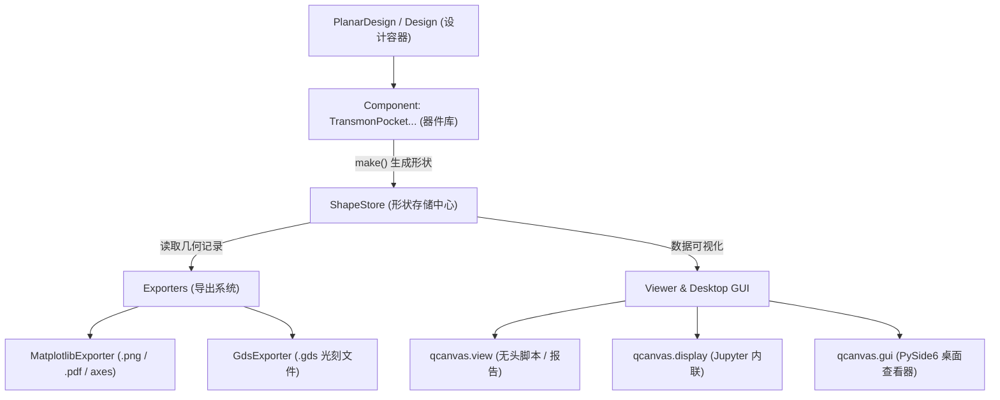

# QCanvas: Superconducting Qubit Layout Design Framework

<p align="center">
  <b>A modern, decoupled, plugin-driven layout engine for superconducting quantum chips.</b>
</p>

---

## 📖 简介 (Introduction)

**QCanvas** 是一个专为超导量子计算芯片设计的参数化版图（Layout）设计框架。它旨在为量子工程师、科研人员与 EDA 开发者提供轻量、高可扩展且解耦的版图设计与导出能力。

### 核心设计哲学 (Core Philosophy)
- 🧩 **几何生成与导出渲染完全解耦**：器件（`Component`）只负责根据参数生成几何形状并提交到存储中心，无需关心渲染后端；导出器（`Exporter`）只从存储中心读取几何并生成目标产物。
- 📦 **单一真相源 (`ShapeStore`)**：以数据类 `ShapeRecord` 统一记录图元、物理层（Layer）、操作属性（如正图形 vs 地平面挖空 `subtract`）与元数据。
- 📏 **无缝物理单位解析**：支持直接输入带单位的字符串（如 `"455um"`、`"10nm"`、`"2.5mm"`），底层自动统一解析为微米（um）浮点数，免除手工换算困扰。
- 🔄 **多后端导出生态**：
  - **Matplotlib**：提供科学绘图、报告插图以及 Jupyter Notebook 内联交互预览。
  - **GDSII (`gdstk`)**：一键生成符合半导体光刻制造标准的 `.gds` 文件，支持芯片地平面（Ground Plane）自动掏空。
- 🖥️ **双模查看器**：
  - **无头/自动化脚本**：`qcanvas.view(design)` / `qcanvas.display(design)`，适用于 CI/CD 与无图形界面服务器。
  - **桌面图形界面**：基于 PySide6 + Matplotlib 的交互式查看器（`qcanvas.gui`），支持器件列表筛选、图层切换与 GDS 导出。

---

## 🏗️ 架构概览 (Architecture)



---

## ⚡ 快速上手 (Quick Start)

### 1. 环境安装 (Installation)

本项目推荐使用现代 Python 包管理工具 [`uv`](https://github.com/astral-sh/uv)：

```bash
# 克隆仓库
git clone https://github.com/quantum-panda-a/QCanvas.git
cd QCanvas

# 使用 uv 一键安装依赖并同步虚拟环境
uv sync
```

或使用标准 `pip` 安装：

```bash
pip install -e .
```

---

### 2. 基础示例：创建芯片版图并导出 (Python API)

```python
import qcanvas
from qcanvas.components import TransmonPocket
from qcanvas.designs import PlanarDesign

# 1. 创建单芯片平面设计容器 (Planar Die)
design = PlanarDesign()

# 2. 实例化 Transmon 量子比特并配置几何参数
q1 = TransmonPocket(
    design,
    name="Q1",
    options={
        "pos_x": "-2.0mm",
        "pos_y": "0.0mm",
        "pad_width": "450um",
        "pad_height": "90um",
        "pad_gap": "30um",
        "pocket_width": "650um",
        "pocket_height": "650um",
        "connection_pads": {
            "readout": {
                "pad_width": "120um",
                "pad_height": "30um",
                "pad_gap": "15um"
            }
        },
    },
)

# 3. 添加第二个量子比特
q2 = TransmonPocket(
    design,
    name="Q2",
    options={
        "pos_x": "2.0mm",
        "pos_y": "0.5mm",
        "orientation": "90",  # 旋转 90 度
    },
)

# 4. 预览版图 (Matplotlib 绘图)
fig = qcanvas.view(design, title="2-Qubit Planar Layout")
fig.savefig("my_quantum_chip.png", dpi=300)

# 5. 导出制造级 GDSII 文件 (含地平面自动挖空)
gds_file = design.export(
    "gds",
    filepath="my_quantum_chip.gds",
    ground_plane=True,
    ground_layer=1,
)
print(f"GDSII 版图已生成: {gds_file}")
```

---

### 3. 启动桌面端查看器 (Desktop GUI)

你可以直接通过命令行启动自带的交互式版图查看器：

```bash
# 启动内置交互式 GUI 查看器
uv run python -m qcanvas.gui
```

或在 Python 代码中呼出：

```python
import qcanvas.gui

# 传入已有设计并启动
qcanvas.gui.run(design)
```

---

## 📂 模块结构说明 (Module Organization)

```text
src/qcanvas/
├── __init__.py           # 顶层公共 API 导出
├── config.py             # 芯片尺寸、单位及全局显示样式配置
├── components/           # 参数化器件库
│   ├── base.py           # Component 基础抽象类
│   └── transmon.py       # TransmonPocket 电极与结区器件
├── designs/              # 版图装配与设计容器
│   ├── design_base.py    # Design 顶层基类 (管理组件、形状中心与导出器)
│   └── design_planar.py  # PlanarDesign 单芯片共面波导版图
├── draw/                 # 2D 几何运算与绘图底层
│   ├── basic.py          # 基于 Shapely 的几何变换与布尔运算
│   └── mpl.py            # Matplotlib 几何渲染辅助函数
├── shapes/               # 形状数据中心
│   └── store.py          # ShapeRecord 与 ShapeStore (单一真相源)
├── exporters/            # 导出器插件系统
│   ├── base.py           # Exporter 抽象基类与动态注册机制
│   ├── mpl.py            # Matplotlib 图像导出器
│   └── gds.py            # GDSII (gdstk) 光刻版图导出器
├── viewer/               # 视图入口
│   ├── view.py           # 无头查看入口
│   └── show_inline.py    # Jupyter Notebook 友好展示支持
├── gui/                  # PySide6 桌面交互式客户端
│   ├── main_window.py    # 主界面窗口 (元器件树、图层控制、导出面板)
│   └── canvas.py         # Matplotlib-Qt 交互画布
└── utility/              # 基础通用工具集
    ├── attr_dict.py      # 支持属性式点号访问的嵌套字典
    ├── units.py          # 物理单位解析 (um/nm/mm -> float)
    ├── geom_utils.py     # 2D 向量与顶点序列处理
    └── parsing.py        # 递归配置字典解析
```

---

## 🧪 单元测试与开发规范 (Testing & Development)

项目使用 `pytest` 进行单元测试，使用 `ruff` 进行代码风格与类型检查：

```bash
# 运行完整测试套件
uv run pytest -v

# 代码风格与 Lint 检查
uv run ruff check

# 代码自动格式化
uv run ruff format
```

---

## 📄 开源许可证 (License)

本项目采用 MIT 开源许可证。
