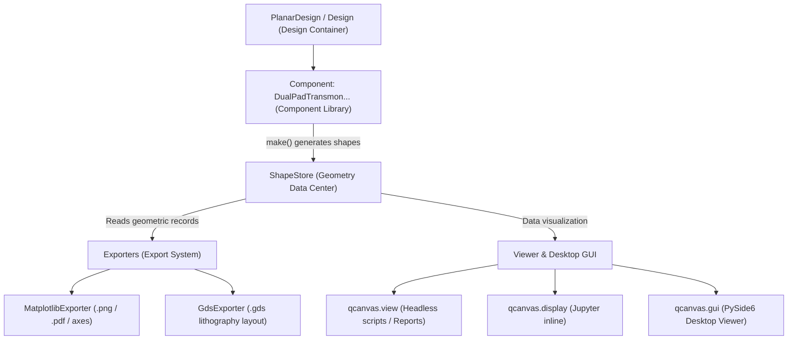

<p align="center">
  
</p>

<h1 align="center">QCanvas</h1>

<p align="center">
  <b>Superconducting Qubit Layout Design Framework</b><br>
  <sub>A modern, decoupled, plugin-driven layout engine for superconducting quantum chips.</sub>
</p>

<p align="center">
  <a href="https://github.com/quantum-panda-a/QCanvas/blob/main/LICENSE"></a>
  
  
</p>

---

## 📖 Introduction

**QCanvas** is a parametric layout design framework tailored for superconducting quantum computing chips. It aims to provide quantum engineers, researchers, and EDA developers with lightweight, highly extensible, and decoupled layout design and export capabilities.

### Core Philosophy
- 🧩 **Complete Decoupling of Geometry Generation and Export/Rendering**: Components (`Component`) are solely responsible for generating geometric shapes from parameters and committing them to the storage center, without needing to know about rendering backends; Exporters (`Exporter`) only read geometric records from the store to produce the desired artifacts.
- 📦 **Single Source of Truth (`ShapeStore`)**: Uses the `ShapeRecord` dataclass to uniformly record primitive geometries, physical layers, operational attributes (e.g., positive pattern vs. ground plane `subtract`), and metadata.
- 📏 **Seamless Physical Unit Parsing**: Supports direct input of unit strings (such as `"455um"`, `"10nm"`, `"2.5mm"`), automatically parsed into floating-point numbers in microns ($\mu\text{m}$) under the hood, eliminating manual unit conversion hassle.
- 🔄 **Multi-Backend Export Ecosystem**:
  - **Matplotlib**: Provides publication-quality scientific plots, report figures, and inline interactive previews in Jupyter Notebooks.
  - **GDSII (`gdstk`)**: One-click generation of fabrication-ready `.gds` files adhering to semiconductor lithography standards, with support for automatic ground plane subtraction.
- 🖥️ **Dual-Mode Viewer**:
  - **Headless / Automated Scripting**: `qcanvas.view(design)` / `qcanvas.display(design)`, suitable for CI/CD pipelines and headless servers.
  - **Desktop GUI**: An interactive viewer (`qcanvas.gui`) built with PySide6 + Matplotlib, supporting component tree filtering, layer toggling, and GDS export.

---

## 🏗️ Architecture



---

## ⚡ Quick Start

### 1. Installation

We recommend using [`uv`](https://github.com/astral-sh/uv), a modern Python package manager:

```bash
# Clone the repository
git clone https://github.com/quantum-panda-a/QCanvas.git
cd QCanvas

# Install dependencies and sync virtual environment with uv
uv sync
```

Or install with standard `pip`:

```bash
pip install -e .
```

---

### 2. Basic Example: Create Chip Layout and Export (Python API)

```python
import qcanvas
from qcanvas.components import DualPadTransmon
from qcanvas.designs import PlanarDesign
from qcanvas.exporters import export_gds

# 1. Create a single-chip planar design container (Planar Die)
design = PlanarDesign()

# 2. Instantiate a Transmon qubit and configure geometry parameters
q1 = DualPadTransmon(
    design,
    name="Q1",
    options={
        "pos_x": "-2.0mm",
        "pos_y": "0.0mm",
        "pad_width": "450um",
        "pad_height": "90um",
        "pad_gap": "30um",
        "gap_top": "35um",
        "gap_down": "35um",
        "gap_left": "35um",
        "gap_right": "35um",
        "pad_fillet": "5um",
        "cutout_fillet": "10um",
        "ground_guard": "30um",
    },
)

# 3. Add a second qubit
q2 = DualPadTransmon(
    design,
    name="Q2",
    options={
        "pos_x": "2.0mm",
        "pos_y": "0.5mm",
        "orientation": "90",  # Rotate 90 degrees
    },
)

# 4. Preview layout (Matplotlib plot)
fig = qcanvas.view(design, title="2-Qubit Planar Layout")
fig.savefig("my_quantum_chip.png", dpi=300)

# 5. Export fabrication-ready GDSII file (with automatic ground plane subtraction)
export_gds(design, filepath="my_quantum_chip.gds", ground_plane=True)
```

---

### 3. Interactive Desktop GUI

Launch the desktop viewer to inspect designs with pan, zoom, and live component updates:

```bash
# Launch with the built-in demo layout
uv run python -m qcanvas.gui

# Or pass a custom design file
uv run python -m qcanvas.gui path/to/my_design.py
```

---

## 📂 Module Organization

```text
src/qcanvas/
├── __init__.py           # Top-level public API exports
├── config.py             # Chip dimensions, units, and global style configurations
├── components/           # Parametric component library
│   ├── base.py           # Component abstract base class
│   └── transmon.py       # DualPadTransmon electrode and junction component
├── designs/              # Layout assembly and design containers
│   ├── design_base.py    # Design top-level base class (manages components, shapes, and exporters)
│   └── design_planar.py  # PlanarDesign single-chip CPW layout
├── draw/                 # 2D geometry operations and rendering primitives
│   ├── basic.py          # Shapely-based geometric transformations and boolean operations
│   └── mpl.py            # Matplotlib geometric rendering helper functions
├── shapes/               # Shape data store
│   └── store.py          # ShapeRecord and ShapeStore (Single Source of Truth)
├── exporters/            # Exporter plugin system
│   ├── base.py           # Exporter abstract base class with dynamic registration
│   ├── mpl.py            # Matplotlib image exporter
│   └── gds.py            # GDSII (gdstk) lithography layout exporter
├── viewer/               # Visualization entry points
│   ├── view.py           # Headless viewing entry point
│   └── show_inline.py    # Jupyter Notebook inline display support
├── gui/                  # PySide6 desktop interactive client
│   ├── main_window.py    # Main window (component tree, layer control, export panel)
│   └── canvas.py         # Matplotlib-Qt interactive canvas
└── utility/              # Utility modules
    ├── attr_dict.py      # Dot-accessible nested dictionary
    ├── units.py          # Physical unit parser (um/nm/mm -> float)
    ├── geom_utils.py     # 2D vector and coordinate sequence utilities
    └── parsing.py        # Recursive configuration dictionary parser
```

---

## 🧪 Testing & Development

The project uses `pytest` for unit testing and `ruff` for code styling and linting:

```bash
# Run full test suite
uv run pytest -v

# Code style and lint check
uv run ruff check

# Automatic code formatting
uv run ruff format
```

---

## 📄 License

This project is licensed under the MIT License.
